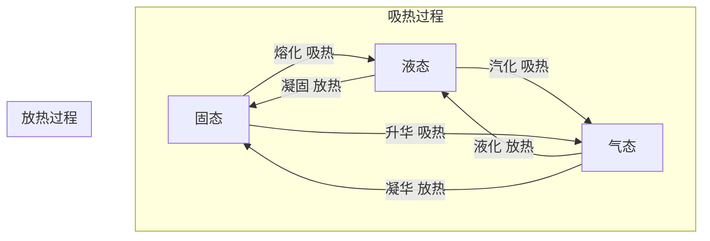

# 初中物理 物态变化 教程

> **适用对象**：浙江省七年级学生（下学期） | **对标教材**：浙教版初中科学七年级下册第2章 | **适用场景**：考前突击复习

---

# 目录

1. [三态六变总览](#三态六变总览)
2. [熔化与凝固](#熔化与凝固)
3. [汽化（蒸发+沸腾）](#汽化蒸发沸腾)
4. [液化](#液化)
5. [升华与凝华](#升华与凝华)
6. [典型例题精讲](#典型例题精讲)
7. [考前速记清单](#考前速记清单)
8. [易错点提醒](#易错点提醒)

---

# 三态六变总览

> **核心定理**：物质的三态变化是**物理变化**（没有新物质生成），过程中物质种类不变。



## 六种变化速查表

| 变化 | 方向 | 吸/放热 | 生活实例 |
|------|------|:------:|----------|
| **熔化** | 固→液 | 吸热 🔥 | 冰化成水、铁熔化成铁水 |
| **凝固** | 液→固 | 放热 ❄️ | 水结成冰、铁水铸成零件 |
| **汽化** | 液→气 | 吸热 🔥 | 水烧开、衣服晾干 |
| **液化** | 气→液 | 放热 ❄️ | 眼镜起雾、露水形成 |
| **升华** | 固→气 | 吸热 🔥 | 樟脑丸变小、干冰消失 |
| **凝华** | 气→固 | 放热 ❄️ | 霜的形成、窗户冰花 |

> 📝 **记忆口诀**：**固→液→气** 都是吸热（能量升高）；反过来（气→液→固）都是放热。

---

# 熔化与凝固

## 晶体 vs 非晶体（高频考点）

| 特征 | 晶体 | 非晶体 |
|------|------|--------|
| 有无固定熔点 | ✅ 有 | ❌ 没有 |
| 熔化过程 | 温度不变（固液共存） | 温度一直升高 |
| 熔化曲线 | 有"平台段" | 平滑上升，无平台 |
| 常见物质 | 冰、海波、各种金属 | 玻璃、沥青、松香、蜂蜡 |
| 凝固过程 | 有固定凝固点 | 无固定凝固点 |

## 晶体熔化曲线解读

```
温度/℃
  │       D
  │      ╱
  │  B——C  (平台段：固液共存)
  │ ╱
  │A
  └────────── 时间/min
```

| 阶段 | 状态 | 温度变化 | 吸/放热 |
|------|------|----------|:------:|
| AB段 | 固态 | 上升 | 吸热 |
| BC段 | **固液共存** | **不变（=熔点）** | 吸热 |
| CD段 | 液态 | 上升 | 吸热 |

> 🔑 **BC 段是理解关键**：温度不变 ≠ 不吸热。晶体在熔化过程中**一直在吸热**，但温度保持在熔点不变，吸收的热量用于破坏晶体结构（"熔化热"）。

## 晶体熔化条件

1. 温度达到**熔点**
2. 继续**吸热**

两个条件**缺一不可**。类似地，晶体凝固条件：① 达到凝固点；② 继续放热。

> ⚠️ **易错**：晶体达到了熔点不一定熔化——还需要持续吸热。

---

# 汽化（蒸发+沸腾）

> 汽化分为两种形式：**蒸发**和**沸腾**。

## 蒸发 vs 沸腾

| 特征 | 蒸发 | 沸腾 |
|------|------|------|
| 发生位置 | 只在液**表面** | 表面和**内部**同时 |
| 发生温度 | **任何温度** | 达到沸点才发生 |
| 剧烈程度 | 缓慢 | 剧烈 |
| 影响因素 | 温度、表面积、空气流速、湿度 | 气压 |

## 影响蒸发快慢的因素

| 因素 | 如何影响 | 应用 |
|------|----------|------|
| 液体温度 ↑ | 蒸发变快 | 晒衣服选晴天 |
| 液体表面积 ↑ | 蒸发变快 | 摊开晾干更快 |
| 液面空气流速 ↑ | 蒸发变快 | 风扇吹 → 加快蒸发 |
| 空气湿度 ↓ | 蒸发变快 | 干燥天气衣服干得快 |

> 💡 **蒸发吸热制冷**：皮肤上的汗蒸发时从皮肤吸热 → 感到凉爽。

## 沸腾与沸点

- **沸点**：液体沸腾时的温度
- **沸点与气压的关系**（重点）：

$$P \uparrow \implies T_{\text{沸}} \uparrow \quad\text{（气压越高，沸点越高）}$$

| 场景 | 气压 | 沸点 |
|------|:--:|------|
| 平原（正常大气压） | 1 atm | 水 100℃ |
| 高原/山上 | 低 | 水 < 100℃（饭煮不熟） |
| 高压锅 | 高 | 水 > 100℃（煮得快） |

---

# 液化

> 液化是汽化的反过程：气态→液态，**放热**。

## 两种方法

| 方法 | 原理 | 实例 |
|------|------|------|
| **降低温度** | 降到露点以下 | 冬天哈出"白气"、露水 |
| **压缩体积** | 增大压强使气体液化 | 液化石油气（LPG）、打火机里的丁烷 |

## "白气"到底是什么？（超高频考点）

> 🔑 **"白气"不是水蒸气！** 水蒸气是无色无味看不见的气体。"白气"是**水蒸气遇冷液化成的小水珠（液态）**。

| 现象 | 实质 |
|------|------|
| 冰棍周围冒"白气" | 空气中水蒸气遇冷液化 |
| 冬天嘴里哈出"白气" | 呼出的水蒸气遇冷空气液化 |
| 烧开水壶嘴冒"白气" | 水沸腾产生的水蒸气在空气中液化 |

---

# 升华与凝华

| 变化 | 方向 | 吸/放热 | 实例 |
|------|------|:------:|------|
| 升华 | 固→气 | 吸热 | 樟脑丸变小、干冰（固态CO₂）消失、冰冻衣服变干 |
| 凝华 | 气→固 | 放热 | 霜、窗户冰花、雾凇 |

> 📝 **干冰（固态二氧化碳）**在常温下直接升华成 CO₂ 气体，过程中大量**吸热** → 用作人工降雨、舞台烟雾。

**用久了的灯泡会发黑**：钨丝先升华（变成钨蒸气），再凝华在灯泡内壁上（黑色固体）→ 升华+凝华的经典例题。

---

# 典型例题精讲

## 例题 1 —— 物态变化判断

**题目**：下列现象属于哪种物态变化？（1）春天冰雪消融；（2）夏天湿衣服变干；（3）秋天早晨草叶上有露珠；（4）冬天窗户玻璃上出现冰花。

| 现象 | 物态变化 | 方向 | 吸/放热 |
|------|----------|------|:------:|
| 冰雪消融 | **熔化** | 固→液 | 吸热 |
| 湿衣服变干 | **蒸发（汽化）** | 液→气 | 吸热 |
| 草叶露珠 | **液化** | 气→液 | 放热 |
| 窗户冰花 | **凝华** | 气→固 | 放热 |

---

## 例题 2 —— 晶体熔化曲线

**题目**：某晶体加热过程中温度-时间图像如下，请回答：
（1）该晶体的熔点是多少？
（2）BC 段处于什么状态？
（3）CD 段是什么状态？

```
温度/℃
80 │     B————C    D
   │    ╱         ╱
40 │   A
   │  ╱
0  └──────────────── 时间/min
   0  2  4  6  8  10
```

**解答**：
（1）熔点 = **80℃**（BC 平台段对应的温度）
（2）BC 段：**固液共存**状态（晶体正在熔化）
（3）CD 段：**液态**（已完全熔化）

---

## 例题 3 —— 沸腾条件

**题目**：在高山上用普通锅煮鸡蛋，为什么很难煮熟？如何解决？

**解答**：
- 高山气压低 → 水的沸点降低（< 100℃）
- 水在低于 100℃ 就沸腾了，温度不够高 → 鸡蛋煮不熟
- 解决方法：使用**高压锅**，增大锅内气压 → 提高沸点 → 水温可以超过 100℃。

---

## 例题 4 —— "白气"辨析

**题目**：夏天从冰箱里拿出一瓶饮料，瓶外壁很快"出汗"，这些水珠是怎么来的？

**解答**：
- 瓶外壁的水珠**不是从瓶内渗出来的**
- 而是空气中**水蒸气遇冷（瓶壁温度低）液化**形成的小水滴
- 物态变化：**液化**（气→液），**放热**。

---

## 例题 5 —— 蒸发影响因素

**题目**：农民晒稻谷时，为什么要把稻谷摊开并放在阳光下？

**解答**：
- **摊开** → 增大液体表面积 → 蒸发加快
- **放阳光下** → 提高温度 → 蒸发加快
- 两者共同作用使稻谷中水分快速蒸发，稻谷变干。

---

# 考前速记清单

| # | 必记知识点 |
|:-:|------------|
| 1 | 六种变化口诀：固→液→气 都吸热，气→液→固 都放热 |
| 2 | 晶体有固定熔点（有平台段），非晶体没有 |
| 3 | 晶体熔化条件：①达熔点 ②继续吸热，两者缺一不可 |
| 4 | "白气"是液体小水珠，**不是水蒸气**（水蒸气看不见） |
| 5 | 气压高→沸点高（高压锅），气压低→沸点低（高原煮不熟饭） |
| 6 | 蒸发吸热制冷；影响蒸发因素：温度、表面积、空气流速 |
| 7 | 干冰升华吸热；钨丝先升华后凝华（灯泡发黑） |
| 8 | 液化两种方法：降温、压缩体积 |

---

# 易错点提醒

| 易错点 | 正确理解 |
|--------|----------|
| ❌ 晶体熔化时温度不变=不吸热 | ✅ 一直在吸热！热量用于破坏晶体结构 |
| ❌ "白气"是水蒸气 | ✅ 水蒸气看不见，"白气"是液化后的小水珠 |
| ❌ 蒸发只在高温时发生 | ✅ 蒸发在**任何温度**都能发生 |
| ❌ 达到熔点就一定会熔化 | ✅ 还要继续吸热！缺一不可 |
| ❌ 冰的熔点固定为 0℃ | ✅ 冰的熔点和水的凝固点都是 0℃（同种物质熔点和凝固点相同） |
| ❌ 冬天晾衣服不会干 | ✅ 冰可以直接升华（冰冻衣服也能干） |
