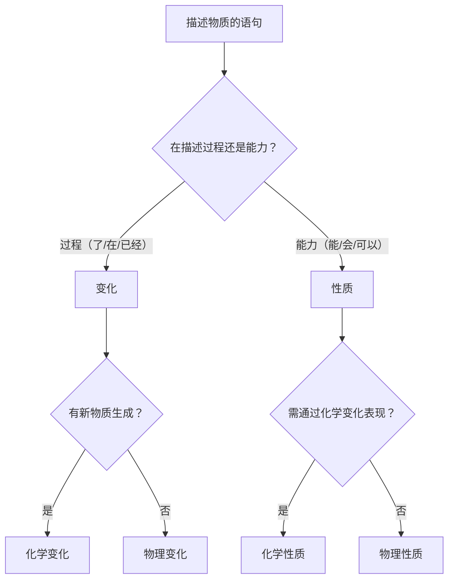
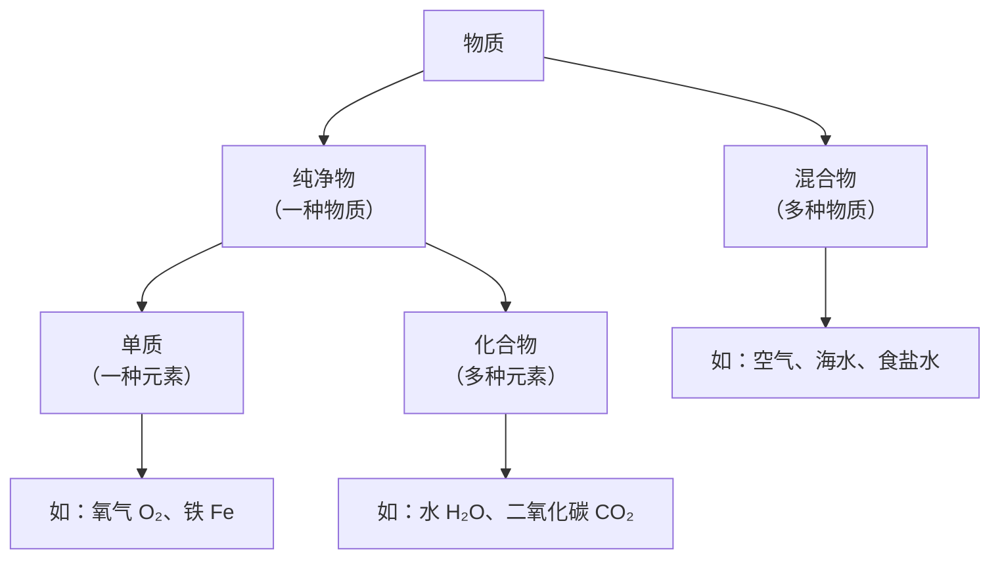

# 初中物理 物质的变化与性质 教程

> **适用对象**：浙江省七年级学生（下学期） | **对标教材**：浙教版初中科学七年级下册第3章 | **适用场景**：考前突击复习

---

# 目录

1. [核心概念：变化 vs 性质](#核心概念变化-vs-性质)
2. [物理变化与化学变化](#物理变化与化学变化)
3. [物理性质与化学性质](#物理性质与化学性质)
4. [变化与性质的区分（最易错）](#变化与性质的区分最易错)
5. [物质分类速览](#物质分类速览)
6. [典型例题精讲](#典型例题精讲)
7. [考前速记清单](#考前速记清单)
8. [易错点提醒](#易错点提醒)

---

# 核心概念：变化 vs 性质

> 🔑 **一句话区分**：
> - **变化**：是一个**过程**（正在发生/已经发生）→ 动词描述
> - **性质**：是一种**能力/特征**（不一定正在发生）→ "能/会/可以/容易"描述

| 概念 | 本质 | 判断词 | 举例 |
|------|------|--------|------|
| **变化** | 一个**过程** | 了、在、已经 | 蜡烛**燃烧了** |
| **性质** | 一种**能力/属性** | 能、会、可以、容易、具有 | 蜡烛**能燃烧** |

---

# 物理变化与化学变化

> **根本区别**：是否有**新物质**生成。

| 对比维度 | 物理变化 | 化学变化 |
|----------|----------|----------|
| **本质** | 没有新物质生成 | 有新物质生成 |
| **分子层面** | 分子本身不变 | 分子改变，原子重组 |
| **常见现象** | 形状变、状态变 | 发光、放热、变色、产生气体、生成沉淀 |
| **可逆性** | 通常可逆 | 通常不可逆 |
| **伴随现象** | 无 | 可能有发光/放热/变色/气体/沉淀 |

## 常见物理变化

| 实例 | 解释 |
|------|------|
| 水结成冰 | 状态变（液→固），仍是 H₂O |
| 玻璃破碎 | 形状变，仍是玻璃 |
| 食盐溶于水 | 溶解，NaCl 分子没变 |
| 酒精挥发 | 状态变（液→气），仍是酒精 |
| 铁丝弯折 | 形状变，仍是铁 |

## 常见化学变化

| 实例 | 解释 |
|------|------|
| 木柴燃烧 | 生成 CO₂ 等新物质 |
| 铁生锈 | Fe → Fe₂O₃（新物质） |
| 食物腐烂 | 有机物分解成新物质 |
| 石灰石与盐酸 | 产生 CO₂ 气体（新物质） |
| 食物消化 | 大分子分解为小分子 |

> ⚠️ **注意**：伴随发光/放热的不一定是化学变化。灯泡发光是**物理变化**（钨丝没变），蜡烛燃烧才是化学变化。

---

# 物理性质与化学性质

> **根本区别**：是否需要通过**化学变化**才能表现出来。

| 对比 | 物理性质 | 化学性质 |
|------|----------|----------|
| **定义** | 不需化学变化就能表现的性质 | 需要通过化学变化才能表现的性质 |
| **感官** | 可直接观察或简单测量 | 不能直接观察 |
| **包含** | 颜色、气味、状态、密度、熔点、沸点、硬度、导电性 | 可燃性、氧化性、酸碱性、稳定性、毒性 |

## 常见物理性质

| 性质 | 说明 |
|------|------|
| 颜色 | 铜是紫红色，铁是银白色 |
| 状态 | 常温下水是液体 |
| 密度 | 铁的密度 7.9 g/cm³ |
| 熔点/沸点 | 冰的熔点 0℃，水的沸点 100℃ |
| 硬度 | 金刚石最硬 |
| 导电性 | 铜导电，橡胶不导电 |
| 溶解性 | 食盐可溶于水，沙子不溶于水 |

## 常见化学性质

| 性质 | 说明 |
|------|------|
| **可燃性** | 酒精能燃烧，水不能燃烧 |
| **氧化性** | 铁在潮湿空气中会生锈 |
| **酸碱性** | 食醋呈酸性，肥皂水呈碱性 |
| **稳定性** | 黄金化学性质稳定，不易生锈 |
| **毒性** | 一氧化碳有毒 |

---

# 变化与性质的区分（最易错）

> 🔑 这是考试中**错误率最高**的知识点。

| 语句 | 是变化还是性质？ | 理由 |
|------|:----------:|------|
| 蜡烛**燃烧** | 化学**变化** | 描述正在发生的过程 |
| 蜡烛**能燃烧** | 化学**性质** | 描述蜡烛具有的能力 |
| 铁**生锈了** | 化学**变化** | 描述已经发生的过程 |
| 铁**容易生锈** | 化学**性质** | 描述铁具有的属性 |
| 水**沸腾了** | 物理**变化** | 描述正在发生的过程 |
| 水的**沸点**是 100℃ | 物理**性质** | 描述水的固有属性 |

> 📝 **口诀**：**"了/在/已经"是变化，"能/会/可以/容易"是性质。**

## 性质决定用途

| 物质 | 利用的性质 | 类型 | 用途 |
|------|-----------|:--:|------|
| 铜 | 导电性 | 物理 | 电线 |
| 钨 | 熔点高 | 物理 | 灯泡灯丝 |
| 金刚石 | 硬度大 | 物理 | 切割玻璃 |
| 天然气 | 可燃性 | 化学 | 燃料 |
| 酒精 | 可燃性 | 化学 | 酒精灯燃料 |
| 干冰 | 升华吸热 | 物理 | 人工降雨 |

---

# 物质分类速览

| 分类 | 定义 | 例子 |
|------|------|------|
| 纯净物 | 只含一种物质 | 蒸馏水、纯氧、纯铁 |
| 混合物 | 含两种及以上物质 | 空气、海水、饮料、合金 |
| 单质 | 纯净物 + 只含一种元素 | O₂、Fe、Cu |
| 化合物 | 纯净物 + 含两种及以上元素 | H₂O、CO₂、NaCl |

---

# 典型例题精讲

## 例题 1 —— 变化类型判断

**题目**：判断下列变化是物理变化还是化学变化：
① 玻璃破碎 ② 食物腐烂 ③ 酒精挥发 ④ 铁生锈 ⑤ 水通电分解

| 序号 | 变化 | 类型 | 理由 |
|:----:|------|:----:|------|
| ① | 玻璃破碎 | 物理 | 形状变，无新物质 |
| ② | 食物腐烂 | 化学 | 有机物分解，有新物质 |
| ③ | 酒精挥发 | 物理 | 状态变，仍是酒精 |
| ④ | 铁生锈 | 化学 | 铁变成铁锈（新物质） |
| ⑤ | 水通电分解 | 化学 | H₂O → H₂ + O₂（新物质） |

---

## 例题 2 —— 变化 vs 性质区分

**题目**：下列描述中，哪些是变化，哪些是性质？并判断物理/化学。
① 木柴在燃烧 ② 木柴能燃烧 ③ 水的密度是 1 g/cm³ ④ 水结成了冰

| 序号 | 描述 | 类型 | 理由 |
|:----:|------|:---:|------|
| ① | 木柴在燃烧 | **化学变化** | "在"=过程 + 有新物质 |
| ② | 木柴能燃烧 | **化学性质** | "能"=能力，需化学变化表现 |
| ③ | 水密度 1 g/cm³ | **物理性质** | 固有属性，不需化学变化 |
| ④ | 水结成了冰 | **物理变化** | "了"=过程，但状态变无新物质 |

---

## 例题 3 —— 性质与用途

**题目**：下列用途利用了物质的什么性质？是物理性质还是化学性质？
① 用铜做电线 ② 用天然气做燃料 ③ 用金刚石切割玻璃

| 序号 | 用途 | 利用的性质 | 类型 |
|:----:|------|-----------|:----:|
| ① | 铜做电线 | 导电性 | 物理性质 |
| ② | 天然气做燃料 | 可燃性 | 化学性质 |
| ③ | 金刚石切割玻璃 | 硬度大 | 物理性质 |

---

## 例题 4 —— 物质分类

**题目**：将下列物质分类为纯净物或混合物：
① 蒸馏水 ② 空气 ③ 食盐水 ④ 纯氧 ⑤ 海水

| 序号 | 物质 | 分类 | 理由 |
|:----:|------|:---:|------|
| ① | 蒸馏水 | 纯净物 | 只有 H₂O 一种物质 |
| ② | 空气 | 混合物 | 含 N₂、O₂、CO₂ 等多种物质 |
| ③ | 食盐水 | 混合物 | 含 NaCl 和 H₂O |
| ④ | 纯氧 | 纯净物 | 只有 O₂ 一种物质 |
| ⑤ | 海水 | 混合物 | 含水、NaCl、多种矿物质 |

---

## 例题 5 —— 现象辨析（综合）

**题目**：蜡烛燃烧既包含物理变化又包含化学变化，请指出各自表现。

**解答**：

| 变化类型 | 表现 | 解释 |
|----------|------|------|
| **物理变化** | 蜡烛熔化（固态→液态） | 石蜡状态变，仍是石蜡 |
| **化学变化** | 蜡烛燃烧，产生 CO₂ 和水蒸气 | 石蜡与氧气反应，生成新物质 |

> 💡 化学变化中往往**伴随物理变化**（如反应放热使物质熔化），但不能说物理变化伴随化学变化。

---

# 考前速记清单

| # | 必记知识点 |
|:-:|------------|
| 1 | 变化=过程（"了/在/已经"），性质=能力（"能/会/可以"） |
| 2 | 物理变化：无新物质（三态变、形状变、溶解） |
| 3 | 化学变化：有新物质（燃烧、生锈、腐烂、分解） |
| 4 | 物理性质：可直接感知（颜色、密度、熔点、导电性） |
| 5 | 化学性质：需化学变化表现（可燃性、氧化性、酸碱性） |
| 6 | "蜡烛燃烧"=化学变化，"蜡烛能燃烧"=化学性质 |
| 7 | 纯净物=一种物质，混合物=多种物质 |
| 8 | 化学变化常伴随物理变化（反过来不一定） |

---

# 易错点提醒

| 易错点 | 正确理解 |
|--------|----------|
| ❌ 发光就是化学变化 | ✅ 灯泡发光是物理变化（钨丝没变） |
| ❌ 有气体产生就是化学变化 | ✅ 水沸腾产生水蒸气是物理变化 |
| ❌ 变化=性质 | ✅ 变化是过程，性质是能力，完全不同 |
| ❌ "能燃烧"是化学变化 | ✅ 是化学**性质**（"能"=能力，不是过程） |
| ❌ 溶解是化学变化 | ✅ 食盐溶于水是物理变化（NaCl 没变） |
| ❌ 化学变化中没有物理变化 | ✅ 化学变化往往伴随物理变化（如先熔化再反应） |
