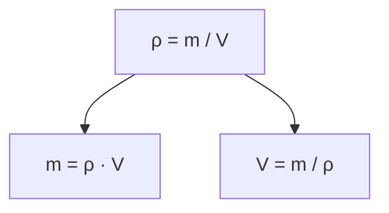
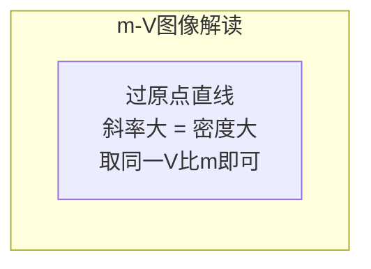

# 初中物理 质量与密度 教程

> **适用对象**：浙江省七年级学生（下学期） | **对标教材**：浙教版初中科学七年级下册第1章 | **适用场景**：考前突击复习

---

# 目录

1. [第一章：质量](#第一章质量)
2. [第二章：天平的使用](#第二章天平的使用)
3. [第三章：密度](#第三章密度)
4. [第四章：密度公式三量计算](#第四章密度公式三量计算)
5. [第五章：密度的测量实验](#第五章密度的测量实验)
6. [第六章：密度图像题（重难点）](#第六章密度图像题重难点)
7. [第七章：空心与实心问题](#第七章空心与实心问题)
8. [第八章：典型例题精讲](#第八章典型例题精讲)
9. [考前速记清单](#考前速记清单)
10. [易错点提醒](#易错点提醒)

---

# 第一章：质量

## 1.1 质量的定义

> **定义**：物体所含物质的多少叫做**质量**（mass），用字母 **$m$** 表示。

质量是物体本身的一种**固有属性**——它不随物体的**形状**、**状态**、**位置**、**温度**的改变而改变。

| 场景 | 质量变不变？ | 原因 |
|------|:----------:|------|
| 冰化成水 | 不变 | 状态变了，物质多少没变 |
| 橡皮泥捏成不同形状 | 不变 | 形状变了，物质没多没少 |
| 宇航员从地球到月球 | 不变 | 位置变了，物质多少不变 |
| 铁块加热到 500°C | 不变 | 温度变了，物质没增减 |

> ⚠️ **易错点**：质量不变 ≠ 重量不变。到月球上质量不变，但**重力（重量）变小**（$G = mg$，月球上 $g$ 只有地球的 $\frac{1}{6}$）。

## 1.2 质量的单位

```
吨(t) → 千克(kg) → 克(g) → 毫克(mg)
  ×1000      ×1000      ×1000        （反过来 ÷1000）
```

| 单位 | 换算关系 | 常见参照物 |
|------|----------|------------|
| 吨 (t) | $1\text{t} = 10^3\text{ kg}$ | 一辆小汽车 ≈ 1.5 t |
| 千克 (kg) | **国际单位制基本单位** | 一瓶矿泉水 ≈ 0.5 kg |
| 克 (g) | $1\text{g} = 10^{-3}\text{ kg}$ | 一枚鸡蛋 ≈ 50 g |
| 毫克 (mg) | $1\text{mg} = 10^{-6}\text{ kg}$ | 一片药片 ≈ 200 mg |

# 第二章：天平的使用

## 2.1 托盘天平结构

```
     ┌──────────────┐
     │    横梁      │
┌────┼──────┬───────┼────┐
│    │      │       │    │
托盘  │  指针+分度盘  │  托盘
(左)  │      │       │  (右)
│  游码   标尺       │    │
└───┴──────┴───────┴────┘
        底座 + 平衡螺母
```

| 部件 | 作用 |
|------|------|
| 平衡螺母 | 称量**前**调节平衡 |
| 游码 + 标尺 | 称量时微调（相当于在右盘加小砝码） |

## 2.2 天平使用三步走

**第一步：调节（称量前）**
1. **放平**：天平放在水平台面上
2. **归零**：游码拨到标尺左端"0"刻度
3. **调平**：调节平衡螺母 → 指针指在分度盘中央

> 口诀：**左偏右调，右偏左调**

**第二步：称量**
1. **左物右码**：物体放左盘，砝码放右盘（用镊子夹取）
2. **先大后小**：先加质量大的砝码，再加小的
3. **游码微调**：砝码不够时，移动游码使天平平衡

**第三步：读数**
$$m_{\text{物体}} = m_{\text{砝码}} + m_{\text{游码示数}}$$

> ⚠️ 游码读数：读游码**左侧**对应的刻度值。

## 2.3 注意事项

| 规则 | 原因 |
|------|------|
| 不能超过**量程** | 超过会损坏天平 |
| 砝码用**镊子**夹取 | 手上有汗渍会腐蚀砝码 |
| 不能直接放潮湿/腐蚀性物体 | 用烧杯或纸片垫着 |
| 称量中**不能再调平衡螺母** | 会改变已调好的零点 |

# 第三章：密度

## 3.1 密度的定义

> **定义**：某种物质**单位体积的质量**叫做**密度**（density），用字母 **$\rho$** 表示。

$$\rho = \frac{m}{V}$$

| 符号 | 含义 | 国际单位 |
|------|------|----------|
| $\rho$ | 密度 | $\text{kg/m}^3$ |
| $m$ | 质量 | $\text{kg}$ |
| $V$ | 体积 | $\text{m}^3$ |

## 3.2 密度是物质的一种特性

> **核心理解**：密度是物质本身的属性，同种物质密度相同，与物体的质量、体积无关。

```
一杯水 → 倒掉一半 → 剩下半杯水
         质量减半，体积减半 → 密度不变！ρ 还是 1.0 g/cm³
```

| 物质 | 密度 (g/cm³) | 密度 (kg/m³) |
|------|:----------:|:------------:|
| 水 | 1.0 | $1.0 \times 10^3$ |
| 酒精 | 0.8 | $0.8 \times 10^3$ |
| 铁 | 7.9 | $7.9 \times 10^3$ |
| 铝 | 2.7 | $2.7 \times 10^3$ |
| 冰 | 0.9 | $0.9 \times 10^3$ |

> 💡 **冰的密度比水小**，所以冰浮在水面上。

## 3.3 密度单位换算（高频考点）

$$1\text{ g/cm}^3 = 10^3\text{ kg/m}^3 = 1000\text{ kg/m}^3$$

推导：$1\text{ g/cm}^3 = \dfrac{10^{-3}\text{ kg}}{10^{-6}\text{ m}^3} = 10^3\text{ kg/m}^3$

> 🔑 记法：$\text{g/cm}^3$ → $\text{kg/m}^3$ **乘** 1000；反过来**除** 1000。

# 第四章：密度公式三量计算

## 4.1 核心公式及变形



| 已知 | 求 | 公式 | 口诀 |
|:--:|:--:|------|------|
| $m, V$ | $\rho$ | $\rho = \dfrac{m}{V}$ | 密度 = 质量 ÷ 体积 |
| $\rho, V$ | $m$ | $m = \rho V$ | 质量 = 密度 × 体积 |
| $m, \rho$ | $V$ | $V = \dfrac{m}{\rho}$ | 体积 = 质量 ÷ 密度 |

## 4.2 解题规范

**步骤**：(1) 列出已知量（带单位）→ (2) 写出公式 → (3) 代入数据 → (4) 计算结果 → (5) 写答

**例题**：一块铁块质量为 158 g，体积为 20 cm³，求密度。
- 已知：$m = 158\text{ g}$，$V = 20\text{ cm}^3$
- $\rho = \frac{158}{20} = 7.9\text{ g/cm}^3$ → 查表知是铁，且为实心。

# 第五章：密度的测量实验

## 5.1 测量不规则固体的密度（排水法）

```
器材：天平、量筒、水、细线、待测固体

   ①称质量m      ②读V₁(水)      ③读V₂(水+固体)
  ┌─────┐       ┌─────┐        ┌─────┐
  │固体 │       │ 水  │        │水+固│
  └─────┘       └─────┘        └─────┘
  天平          量筒(水)       量筒(浸没后)

  V(固体) = V₂ - V₁    →    ρ = m / (V₂ - V₁)
```

**步骤**：① 天平称固体质量 $m$ → ② 量筒倒入适量水，读 $V_1$ → ③ 细线系固体浸没，读 $V_2$ → ④ $V_{\text{固}} = V_2 - V_1$ → ⑤ $\rho = \frac{m}{V_2 - V_1}$

> ⚠️ **先称质量再量体积**！先浸水后称，表面沾水使质量偏大。

## 5.2 测量液体密度

**步骤**：① 称空烧杯 $m_1$ → ② 倒入液体，称总质量 $m_2$，$m_{\text{液}} = m_2 - m_1$ → ③ 倒入量筒读 $V$ → ④ $\rho = \frac{m_2 - m_1}{V}$

> ⚠️ 烧杯液体无法完全倒出（有残留）→ $V$ 偏小 → $\rho$ 偏大。

# 第六章：密度图像题（重难点）

## 6.1 m-V 图像的本质

$$m = \rho \cdot V \quad \Leftrightarrow \quad y = k \cdot x$$

在 $m$-$V$ 图中，**斜率 $k$ = 密度 $\rho$**。

| 图像特征 | 物理含义 |
|----------|----------|
| 过原点的直线 | 同种物质，$m$ 与 $V$ 成正比 |
| 斜率越大（线越陡） | 密度越大 |
| 不是直线 | 密度在变化 |



## 6.2 解题技巧

> 图像题三步走：① 看是否过原点 → ② 竖直取一点比质量（同一 $V$ 下谁 $m$ 大谁密度大）→ ③ 算具体密度值。

# 第七章：空心与实心问题

## 7.1 三种判断方法

| 方法 | 操作 | 判断为空心 |
|------|------|------------|
| **比密度** | $\rho_{\text{算}} < \rho_{\text{标}}$ | 算出的密度偏小 |
| **比质量** | $m_{\text{算}} > m_{\text{实}}$ | 假设实心的质量 > 实际质量 |
| **比体积** | $V_{\text{实}} < V_{\text{外}}$ | 实际物质体积 < 外壳体积 |

> 🔑 **推荐比体积法**：$V_{\text{实}} = \frac{m}{\rho_{\text{物质}}}$，若 $V_{\text{实}} < V_{\text{外壳}}$ → 空心，$V_{\text{空}} = V_{\text{外壳}} - V_{\text{实}}$。

# 第八章：典型例题精讲

## 例题 1 —— 单位换算

**题**：$7.9 \times 10^3\text{ kg/m}^3 = \underline{\qquad}\text{ g/cm}^3$

**解**：$7.9 \times 10^3 \div 10^3 = 7.9\text{ g/cm}^3$（$\text{kg/m}^3 \to \text{g/cm}^3$ 除以 1000）

## 例题 2 —— 密度计算

**题**：一瓶矿泉水容积 $550\text{ mL}$，装满水后质量？（$\rho_{\text{水}} = 1.0\text{ g/cm}^3$）

**解**：$V = 550\text{ cm}^3$，$m = \rho V = 1.0 \times 550 = 550\text{ g} = 0.55\text{ kg}$

## 例题 3 —— 空心判断

**题**：铁球 $m = 158\text{ g}$，$V = 30\text{ cm}^3$，$\rho_{\text{铁}} = 7.9\text{ g/cm}^3$，判断是否空心。

**解**（比体积法）：
$$V_{\text{铁}} = \frac{m}{\rho_{\text{铁}}} = \frac{158}{7.9} = 20\text{ cm}^3 < 30\text{ cm}^3 \implies \text{空心}$$
$$V_{\text{空}} = 30 - 20 = 10\text{ cm}^3$$

## 例题 4 —— 密度图像题

**题**：m-V 图中 A、B 两线，谁的密度大？求 $\rho_A$。

```
m/g
│      A线
│     ╱
│    ╱  B线
│   ╱  ╱
│  ╱ ╱
│ ╱╱
└──────── V/cm³
```

**解**：取 $V = 10\text{ cm}^3$，读得 $m_A = 80\text{ g}$，$m_B = 30\text{ g}$
$$\rho_A = \frac{80}{10} = 8.0\text{ g/cm}^3,\quad \rho_B = \frac{30}{10} = 3.0\text{ g/cm}^3$$

$\rho_A > \rho_B$，A 线更陡。

## 例题 5 —— 排水法测密度

**题**：石块 $m = 54\text{ g}$，量筒原水 $50\text{ mL}$，浸没后读 $70\text{ mL}$，求 $\rho$。

**解**：$V = 70 - 50 = 20\text{ cm}^3$，$\rho = \frac{54}{20} = 2.7\text{ g/cm}^3$ → 可能是**铝**。

# 考前速记清单

| # | 必记知识点 |
|:-:|------------|
| 1 | 质量是物体属性，**不随形状、状态、位置改变** |
| 2 | $1\text{ g/cm}^3 = 10^3\text{ kg/m}^3$（记水的密度对比：$1.0\text{ g/cm}^3 = 1000\text{ kg/m}^3$） |
| 3 | $\rho = \frac{m}{V}$，$m = \rho V$，$V = \frac{m}{\rho}$（知二求一） |
| 4 | 天平：**左物右码**，读数 = 砝码 + 游码（读左侧） |
| 5 | 排水法：$V_{\text{物}} = V_2 - V_1$，**先称质量再量体积** |
| 6 | 冰密度 $0.9 < 1.0$（水）→ 冰浮在水上 |
| 7 | m-V 图：**斜率 = 密度**，线越陡密度越大 |
| 8 | 空心判断：**比体积法**最靠谱 |

# 易错点提醒

| 易错点 | 正确理解 |
|--------|----------|
| 质量随位置改变 | 质量不变，**重力（重量）**才随位置变 |
| 密度与质量成正比 | 密度是物质特性，与质量/体积**无关** |
| $\text{g/cm}^3$ 比 $\text{kg/m}^3$ 小 | 反了！$1\text{ g/cm}^3 = 1000\text{ kg/m}^3$ |
| 称量时调平衡螺母 | 称量中只能动**游码** |
| 排水法先量体积 | 先称质量！先沾水后称会偏大 |
| "铁比木头重" | 应说"铁的密度比木头大" |
